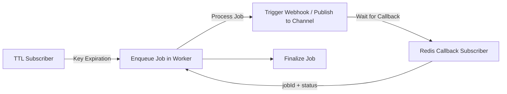

Below is an improved and fully translated version of your README.md. This version provides a clear, real-world explanation of how the application works and how to integrate it with n8n. The content has been adjusted for clarity and to reflect best practices for an event-driven architecture using Redis TTL and BullMQ.

---


# n8n FollowUP with Redis Queue

Join our WhatsApp Group for Support: [https://chat.whatsapp.com/KUL70pP77yiG8T0qPfPE1l](https://chat.whatsapp.com/KUL70pP77yiG8T0qPfPE1l)

**n8n FollowUP with Redis Queue** leverages **Redis** as the main messaging and event-scheduling mechanism. By combining **Redis Streams** and **Redis TTL (Time to Live)**, the application efficiently triggers jobs exactly when a key expires—without relying on periodic polling. This solution harnesses Redis’s native key expiration events to drive real-time workflows in n8n.

---

## Overview

1. **Redis TTL + Expiration Events**  
   - Each key in Redis is assigned a TTL. When a key expires, Redis emits an event on the `__keyevent@0__:expired` channel.
   - The FollowUP application listens to this channel and, upon detecting an expiration, enqueues a job in **BullMQ** to process the required action.

2. **Job Enqueueing and Processing with BullMQ**  
   - Once an expiration event occurs, a job is created in the queue.
   - A **Worker** processes the job by triggering a webhook and/or publishing a message to a Redis channel.
   - The Worker then waits for a callback (via Redis Pub/Sub) to confirm successful job completion.
   - This approach ensures high scalability since retry logic (with backoff) is managed within the queue rather than using external cron jobs.

3. **Callback via Redis Pub/Sub (workflow_success)**  
   - Instead of relying solely on an HTTP endpoint, the application accepts confirmation callbacks via Redis Pub/Sub. For example, publishing a payload like:
     ```json
     { "jobId": "47", "status": "success", "timestamp": 1680000000000 }
     ```
     on the callback channel finalizes the job.
   - This event-driven approach eliminates polling and enables real-time processing.

4. **Action Mapping**  
   - Each key can be associated with a **webhookUrl** and/or a **Redis channel**.
   - For instance, if the key is `key01`, the application triggers a webhook; if it is `key02`, it publishes a message to a channel.
   - The mapping is defined using environment variables (e.g., `KEY_WEBHOOK_MAPPING=key01=https://...,key02=|redisChannel`).

---

## Key Features

- **Webhook Triggering:**  
  When a key expires, the Worker sends an HTTP POST to the configured URL. The response must return a confirmation (typically `success`).

- **Channel Publishing:**  
  If configured, the application publishes a message to the specified Redis channel instead of or in addition to sending a webhook.

- **Event-Driven Callback:**  
  The application waits for a callback via Redis Pub/Sub (on a dedicated callback channel) to finalize the job. This avoids any need for periodic polling.

- **Backoff and Retry:**  
  If a job fails (e.g., due to webhook failure), the system automatically retries the job using a configurable backoff strategy.

---

## Why Use Redis TTL Instead of Polling?

1. **Immediate, Event-Driven Execution**  
   - Redis notifies you immediately when a key expires, eliminating the need for frequent polling and reducing reaction time.

2. **Lower Overhead and Latency**  
   - Polling typically involves running a cron job every minute, which can introduce delays and unnecessary resource consumption.
   - With Redis TTL and expiration events, there’s no periodic overhead—only immediate, real-time event handling.

3. **Simpler Code Base**  
   - Polling requires extra scripts and logic to manage intervals and prevent duplicate processing.
   - With Redis TTL, you simply set the key with `EXPIRE key X` and let Redis handle the expiration event.

4. **High Scalability**  
   - Redis efficiently handles many keys expiring simultaneously and only triggers the necessary events.
   - Polling thousands of keys at intervals would consume far more resources.

In summary, Redis TTL enables an **event-driven**, **precise**, and **efficient** architecture without the complexity or overhead of scheduled polling.

---

## Simplified Architecture



---

## Important Configuration

- **REDIS_URL:** Connection URL for Redis.
- **KEY_WEBHOOK_MAPPING:** Maps each key to its webhook URL and/or channel.
- **BULLMQ_QUEUE_NAME:** Name of the queue used for job management.
- **SUCCESS_CHANNEL / CALLBACK_CHANNEL:** Channel where the Worker publishes the final success event.
- **WORKER_CALLBACK_TIMEOUT:** Maximum time the Worker waits for a callback.
- **DEBUG:** Enable detailed logging for troubleshooting.

---

## How to Run

1. **Clone the Repository**  
   ```bash
   git clone https://github.com/AdilsonNoveli/followup-redis-n8n.git
   cd followup-redis-n8n
   ```

2. **Set Environment Variables**  
   Create a `.env` or update your YAML configuration with:
   ```yaml
   REDIS_URL=redis://redis:6379
   KEY_WEBHOOK_MAPPING=key01=https://your-webhook-url.com/followup01,key02=|yourChannel
   BULLMQ_QUEUE_NAME=webhookQueue
   CALLBACK_CHANNEL=workflow_success
   # Additional configurations as needed...
   ```

3. **Deploy with Docker Swarm**  
   ```bash
   docker stack deploy -c stack.yml followup
   ```

4. **Testing the Workflow**  
   - Set a key in Redis with a TTL, for example:  
     ```bash
     SET key01 "value" EX 60
     ```
   - After 60 seconds, Redis emits the expiration event. The TTL Subscriber enqueues the job, the Worker triggers the webhook or publishes a message, and the system waits for the callback.
   - In n8n, configure your workflow to listen for the callback. Make sure the final payload published on the callback channel includes:
     ```json
     {
       "jobId": "47",
       "status": "success",
       "timestamp":  {{ Date.now() }}
     }
     ```

---

## Future Enhancements

- **Dashboard:**  
  Integrate with [Bull Board](https://github.com/felixmosh/bull-board) or build a custom React dashboard to monitor job status.

- **Configuration API:**  
  Add REST endpoints to dynamically manage keys and mappings.

- **Multiple Queues:**  
  Separate queues for different job priorities and processing strategies.

- **Observability:**  
  Integrate with Prometheus/Grafana for monitoring job metrics and Redis performance.

---

## License

This project is licensed under the [MIT License](LICENSE). Feel free to use, modify, and distribute the code.

If you find this project helpful and want to support its development, consider donating via Pix (QR Code below) or contributing code and ideas. Every contribution helps improve and expand this open-source tool.

### Pix Donation QR Code


---

**n8n FollowUP with Redis Queue** – Transforming key expirations into real-time events without polling.

---

This revised README provides clear context, real examples, and step-by-step instructions for integrating the application with n8n.
