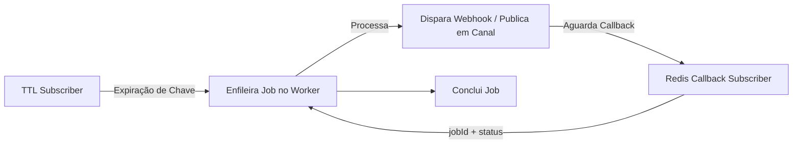

# N8N FollowUP Com Fila no Redis

**FollowUP Com Fila no Redis**, utiliza o **Redis** como principal mecanismo de mensageria e agendamento de eventos, combinando **Redis Streams** e **Redis TTL** (Time to Live) para disparar jobs de forma eficiente. Em vez de usar um polling periódico (por exemplo, um cron job que verifica a cada minuto), a aplicação aproveita o **evento de expiração** nativo do Redis para acionar fluxos no momento exato em que uma chave expira. 

## Visão Geral

1. **Redis TTL + Eventos de Expiração:**  
   - Cada chave no Redis tem um tempo de vida (TTL). Quando a chave expira, o Redis emite um evento no canal `__keyevent@0__:expired`.  
   - A aplicação (FollowUP) escuta esse canal e, ao detectar uma expiração, enfileira um job no **BullMQ** (ou outra biblioteca de filas, como Asynq) para processar a ação necessária.

2. **Enfileiramento e Processamento de Jobs (BullMQ ou Asynq):**  
   - Quando um evento de expiração ocorre, o projeto cria um job na fila.  
   - Um **Worker** processa o job, podendo disparar webhooks ou publicar mensagens em canais Redis, aguardando callbacks para confirmar a conclusão.  
   - Isso garante alta escalabilidade, pois o número de tentativas e a lógica de reprocessamento (backoff) são configurados na fila, não em scripts de cron.

3. **Callback via Redis Pub/Sub (workflow_callback):**  
   - Em vez de depender de um endpoint HTTP, a aplicação pode receber confirmações via Redis Pub/Sub (publicando `{"jobId":..., "status":"success"}` no canal).  
   - Isso evita polling e garante um fluxo totalmente orientado a eventos.

4. **Mapeamento de Ações:**  
   - Cada chave pode ter um **webhookUrl** e/ou um **canal** Redis.  
   - Se for `key01`, a aplicação dispara um webhook. Se for `key02`, publica em um canal.  
   - Esse mapeamento é definido em variáveis de ambiente (por exemplo, `KEY_WEBHOOK_MAPPING=key01=https://...,key02=|redisChannel`).

## Funcionalidades Principais

- **Disparo de Webhooks**: Ao expirar a chave, o Worker envia uma requisição HTTP (POST) para a URL configurada, podendo retornar `success` ou não.  
- **Publicação em Canais**: Se configurado, a aplicação também (ou em vez disso) publica uma mensagem no canal Redis desejado.  
- **Callback Orientado a Eventos**: A aplicação aguarda um callback via Redis Pub/Sub para finalizar o job, evitando qualquer tipo de polling.  
- **Reprocessamento com Backoff**: Se o disparo falha, o sistema pode reprocessar (tentativas + backoff), sem precisar de scripts adicionais.

## Por que Usar TTL do Redis em Vez de Schedule Trigger (Polling)?

1. **Acionamento Exato (Event-Driven)**  
   - Com o **TTL** do Redis, a aplicação é notificada **imediatamente** quando a chave expira, sem precisar verificar a cada X segundos/minutos.  
   - Isso permite reações em tempo quase real.

2. **Menos Sobrecarga e Latência**  
   - No **polling**, você rodaria um cron job (por exemplo, a cada minuto) para checar se algo expirou. Isso pode gerar latência (até 1 minuto de atraso) e overhead constante.  
   - Com o **TTL + evento de expiração**, não há overhead de checagens periódicas e nenhuma latência extra além do evento real de expiração.

3. **Simplicidade de Código**  
   - Com polling, você teria scripts cron ou agendamentos. Precisaria gerenciar intervalos, cuidar de locks para evitar duplicidade, etc.  
   - Com TTL, basta definir `EXPIRE key X`, e o Redis faz o resto, emitindo o evento exato.

4. **Escalabilidade**  
   - Se você tiver muitas chaves expirando, o Redis lida internamente com elas, disparando eventos. A aplicação só reage quando necessário.  
   - No polling, se você tem milhares de chaves, precisa varrer todas a cada intervalo, consumindo recursos.

Em resumo, **TTL do Redis** permite uma arquitetura **event-driven**, **precisa** e **eficiente**, sem a complexidade de manter scripts de agendamento ou overhead de varreduras periódicas.

## Arquitetura Simplificada



## Configurações Importantes

- **REDIS_URL**: URL de conexão ao Redis.  
- **KEY_WEBHOOK_MAPPING**: Mapeia cada chave ao seu webhook e/ou canal.  
- **BULLMQ_QUEUE_NAME**: Nome da fila usada para gerenciar jobs.  
- **SUCCESS_CHANNEL**: Canal onde o Worker publica o evento final de sucesso.  
- **WORKER_CALLBACK_TIMEOUT**: Tempo de espera do Worker para receber o callback via Redis.  
- **DEBUG**: Ativa logs detalhados.

## Como Rodar

1. **Clone o Repositório**  
   ```bash
   git clone https://github.com/usuario/followup-com-fila-redis.git
   cd followup-com-fila-redis
   ```
2. **Defina as Variáveis no `.yaml`** (ou `.env`)  
   ```yaml
   REDIS_URL=redis://redis:6379
   KEY_WEBHOOK_MAPPING=key01=https://...,key02=|myChannel
   BULLMQ_QUEUE_NAME=webhookQueue
   # ...
   ```
3. **Subir via Docker Swarm**  
   ```bash
   docker stack deploy -c stack.yml followup
   ```
4. **Testar**  
   - Defina uma chave no Redis com `TTL` (por ex. `SET key01 "valor" EX 60`).  
   - Após 60s, o Redis emite o evento de expiração, o Worker enfileira o job, dispara o webhook ou canal, e aguarda callback.

## Futuro e Extensões

- **Dashboard**: Integração com [Bull Board](https://github.com/felixmosh/bull-board) ou criação de um painel React.  
- **API de Configuração**: Adicionar endpoints para gerenciar chaves e mapeamentos.  
- **Múltiplas Filas**: Separar filas para diferentes prioridades.  
- **Observabilidade**: Integração com Prometheus/Grafana para métricas de jobs e Redis.

## Licença

[MIT](LICENSE) — Sinta-se à vontade para usar, modificar e distribuir este projeto.

Colabore com qualquer valor, Ajude a manter!


---

**FollowUP Com Fila no Redis** — transformando expirações de chaves em eventos real-time, sem polling.
